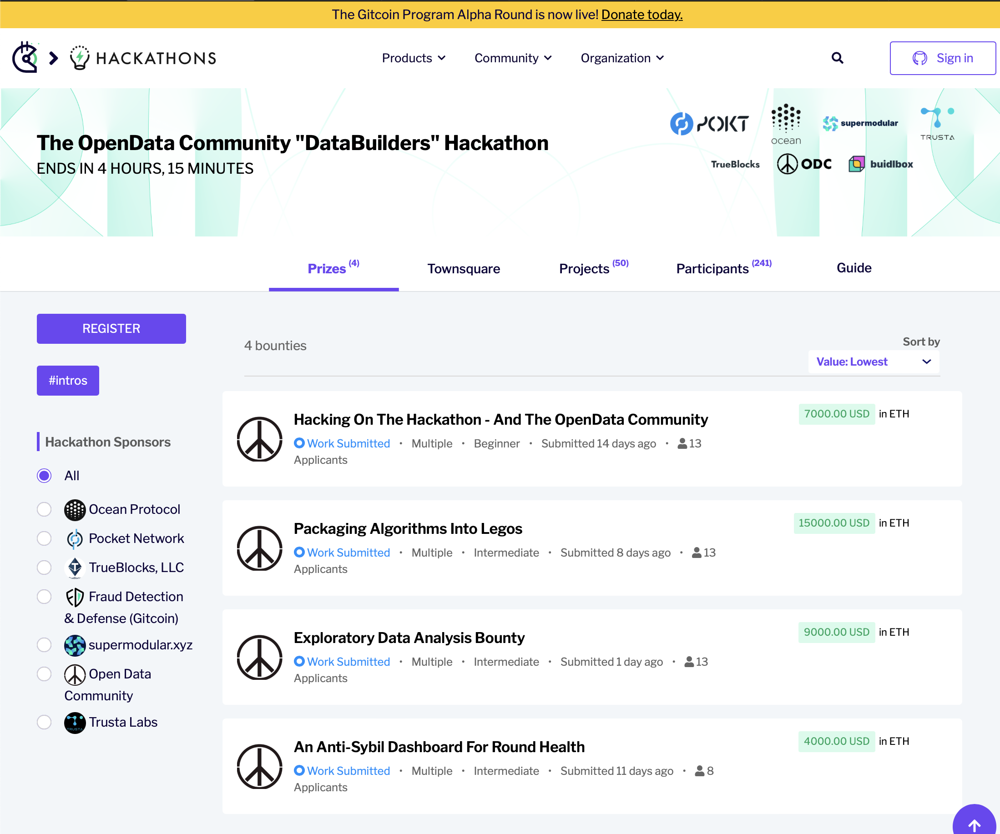

# what next for hackathon submissions

## Communicate results and next steps 

[draft of the results and what's next](https://docs.google.com/document/d/11N5Y3sPvhJ0Hy_w0sjdlbH1wcv8E5c9hl6r8fvsY9ck/edit?usp=sharing)

## Publish hackathon materials permanently

Using these bounties and the resulting work as the sources

1. [Hacking on the Hackathon - And the OpenData Community](https://gitcoin.co/issue/29677) The solution will be ODC docs published via Github PRs as ODC web pages
2. [Packaging Algorithms Into Legos](https://gitcoin.co/issue/29676) The solution will be Lego anti-sybil algorithms posted via the Ocean Protocol as an NFT
3. [Exploratory Data Analysis Bounty](https://gitcoin.co/issue/29675) The solution will be an analysis posted via the Ocean Protocol as an NFT
4. [An Anti-Sybil Dashboard for Round Health](https://gitcoin.co/issue/29674) The solution will be Legos Dashboard posted via the Ocean Protocol as an NFT

ODC will permanently publish the records of the Jan 2023 Hackathon and the resulting submissions and bounty winners via the [ODCDataforWeb3/Jan2023hackathon repository](https://github.com/OpenDataforWeb3/Jan2023hackathon) 

README in the repository explains the history of the hackathon, an overview of the bounties, and the results. 

**Update https://gitcoin.co/hackathon/DataBuilders/? Gitcoin Databuilders Hackathon page with the same content as the README and links back to the ODC Jan2023 Hackathon repository.**

**We need to collaborate with Gitcoin FDD on above changes to the Gitcoin DataBuilders hackathon page.**

Update the OpenDataCommunity.org hackathon menu to link to a local page that highlights the latest hackathon with a link to the ODC Jan2023 Hackathon repository, future event / hackathon plans, and past hackathons. 

## Reach out to a few people and sponsors that can help the ODC immediately

Bounty 1-4 contributors are new potential ODC Jedi members that can help build the community. We can find them work at one of the sponsors and ask that they continue to contribute to future hackathons, projects, and ODC administration. 

Bounty 2-4 contributors may want to continue their work on algorithms, data analysis, and or dashboard as an ODC project.

## As discussed briefly on Discord, with the completion of the Data Builders hackathon - we can look forward to the immediate priorities:

- Sandbox project support
- Running a stack
- Founding Sponsors
- ALSO - however - we should be careful not to accumulate too much centralization or governance debt.

As of early February 2023, we have an informal governance structure.

The multi-sig is secured as a 2/3 - epowell101, DisruptionJoe, and Tigress.

We then have an ODC Jedi group that emerged from those that were attending meetings frequently and otherwise active. The ODC Jedi is a role on the ODC Discord.

We then have roles across Github & the Google calendar and otherwise. These may not be consistent with the ODC Jedi role.

Additionally, epowell101 and Baoki are each currently paid by Gitcoin however dedicate much of their time to the ODC.

And most work is organized into workgroups, which are self-organized on Discord.

For now - we can build organically from the existing Discord organization.

Once the founding sponsors become more engaged - we will expect to have them involved in our governance. We mostly need to be transparent and efficient as we continue to build towards sustainability in February, March and April of 2023

## Groups of people
 
Right now we have 6 groups of people:
- public
- hackathon contributors
- ODC discord members
- ODC Github contributors
- ODC Jedi
- Sponsors

## What is a project

Tiers of ODC membership and project maturity:
- membership: We can continue to establish ODC discord membership as the baseline for being a "ODC member"
- project: practice the basics of team and software development

Let's stop here and wait to define future tiers until we can discuss ideas with sponsors.

## Help the contributors with next steps, Providing ODC sandbox and a bit of tooling

- We provide ODC administrative help to members on how to operate a project
- We create the ODC Sandbox github organization.
- We provide an easy instructions how to create a repository for their work and team. 
- We provide access to tools 
  -  Project: Linear, Dework, Github Project, and / or Jira?
  -  Repository: Github
  -  IDE: Visual Studio Code, Github online, and / or HackMD?
  -  CICD: Github Actions
  -  OpenData stack: Operating stack to be used by the ODC members in the analysis and support of sandbox projects. Likely from the [landscape](../../docs/landscape.md) options.  Partners and / or sponsors may contribute licensing and pricing options. 
-  and recommended ways of using them.

## Regional and or local infrastructure to help with latency

Maybe this is a stretch goal in the early stages of ODC. Publishing a few stretch goals might help get few more sponsors or contributors that want to work towards them. 

We find sponsors and funding to help ODC projects with compute, network, and storage hardware that can improve their ability to operate within their local area. 

Options are: 
- a fanless local compute to run a node off the contributors local internet service provider
- a regional cloud service provider that can provide discounted or subsidized infrastructure for running a node
- a regional internet service provider that can provide discounted or subsidized network for running a node
