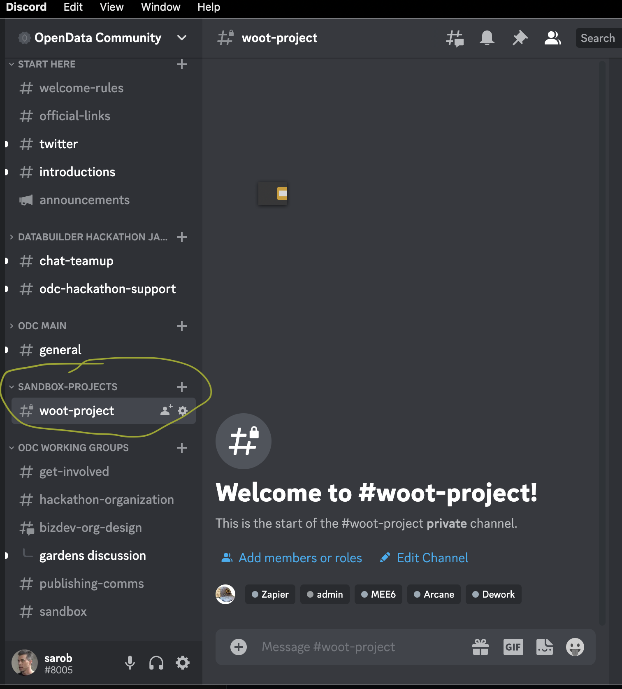
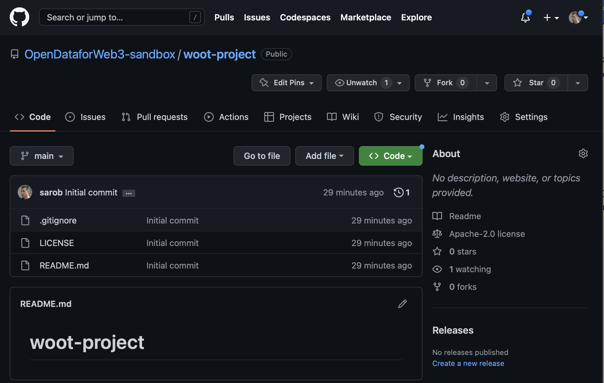

# what next for hackathon submissions

## Communicate results and next steps 

[draft of the results and what's next](https://docs.google.com/document/d/11N5Y3sPvhJ0Hy_w0sjdlbH1wcv8E5c9hl6r8fvsY9ck/edit?usp=sharing)

## Publish hackathon materials permanently

Using these bounties and the resulting work as the sources

1. [Hacking on the Hackathon - And the OpenData Community](https://gitcoin.co/issue/29677) The solution will be ODC docs published via Github PRs as ODC web pages
2. [Packaging Algorithms Into Legos](https://gitcoin.co/issue/29676) The solution will be Lego anti-sybil algorithms posted via the Ocean Protocol as an NFT
3. [Exploratory Data Analysis Bounty](https://gitcoin.co/issue/29675) The solution will be an analysis posted via the Ocean Protocol as an NFT
4. [An Anti-Sybil Dashboard for Round Health](https://gitcoin.co/issue/29674) The solution will be Legos Dashboard posted via the Ocean Protocol as an NFT

ODC will permanently publish the records of the Jan 2023 Hackathon and the resulting submissions and bounty winners via the [ODCDataforWeb3/Jan2023hackathon repository](https://github.com/OpenDataforWeb3/Jan2023hackathon) 

README in the repository explains the history of the hackathon, an overview of the bounties, and the results. 

**Update https://gitcoin.co/hackathon/DataBuilders/? Gitcoin Databuilders Hackathon page with the same content as the README and links back to the ODC Jan2023 Hackathon repository.**

**We need to collaborate with Gitcoin FDD on above changes to the Gitcoin DataBuilders hackathon page.**

Update the OpenDataCommunity.org hackathon menu to link to a local page that highlights the latest hackathon with a link to the ODC Jan2023 Hackathon repository, future event / hackathon plans, and past hackathons. 

## Reach out to a few people and sponsors that can help the ODC immediately

- @Poupou will lead the discussions around projects and names together with @stef-says. See https://github.com/OpenDataforWeb3/sandbox/wiki/1st-workgroup-meeting---17st-Feb

## Help the contributors with next steps, Providing ODC Sandbox, tools, and mentoring

- We provide ODC mentoring to help new members on how to operate a project. The ODC Jedi are the mentors to start.
- We provide the ODC Sandbox github organization https://github.com/OpenDataforWeb3-sandbox 
- The https://github.com/OpenDataforWeb3/sandbox is location of all the how to create and maintain an ODC sandbox project documentation and the index to all the sandbox projects
- We provide easy instructions on how to create a repository within the ODC Sandbox github organization for their work and team. Two good options:
  - Make the project leader a member of the github organization and have them follow https://docs.github.com/en/get-started/quickstart/create-a-repo OR
  - Ask the project leader to push a PR "Create a Sandbox Repository for my XYZ Project" to the OpenDataforWeb3/Sandbox repository and we automate the creation of the repository.
- We provide access to tools:
  - Comms: Discord
  - Project: Github Projects (we setup a project and a training session on using with issues)
  - Wiki: Github wiki (we setup a basic pages)
  - Repository: Github
  - IDE: Visual Studio Code, Github online, and HackMD (we help the project get setup and a training session on pushing PRs)
  - CICD: Github Actions (TBD what we can support)
  - OpenData stack: Operating stack to be used by the ODC members in the analysis and support of sandbox projects. Likely from the [landscape](../../docs/landscape.md) options. Partners and / or sponsors may contribute licensing and pricing options. (TBD what we can support) **A good place to develop strategy on this will be at ETHDenver. Let's revisit this after.**

