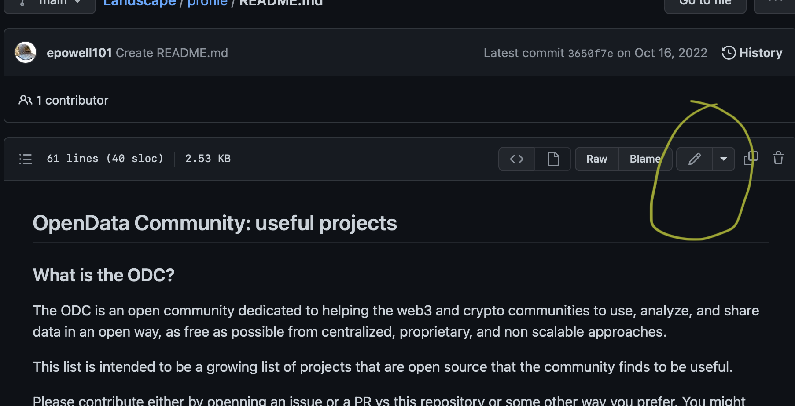
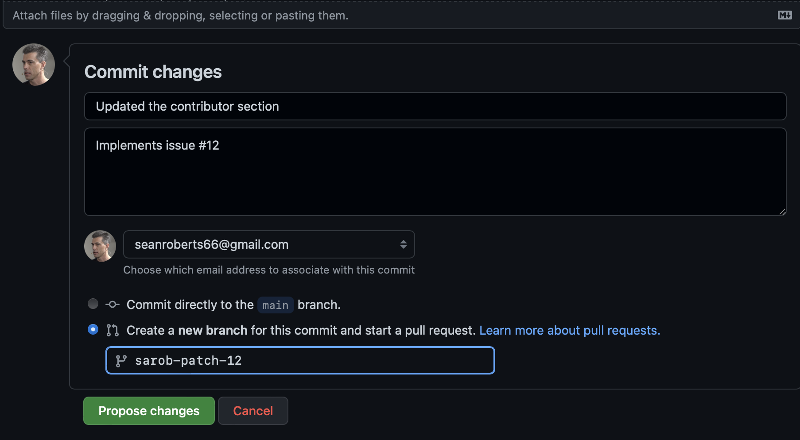
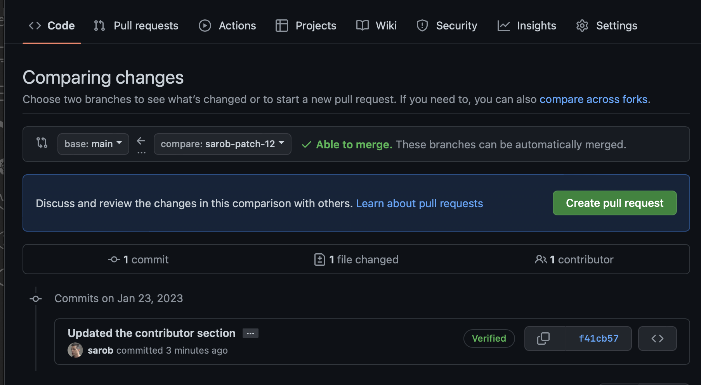
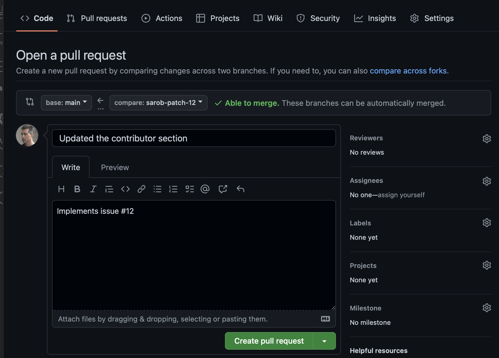

# Welcome to the ODC contributing guide

Thank you for investing your time in contributing to the OpenData Community!  We are excited to build an Open Data Layer for Web3 with you and all of our partners!. 
 
 
 

# How we Coordinate
- We have created working groups that you can get involved in. Please refer to our discord for more info

- You can find our calendar of meetings and events [here](https://calendar.google.com/calendar/u/0/embed?src=698a35b1c1a24bdae78f30cbe3fc081c5fbb681c748a45df61040c6e6f26c932@group.calendar.google.com&ctz=America/Los_Angeles)

- We are using [discord](https://discord.gg/havA38Xa7q) for the community and general coordination.

- We are testing out [Dework](https://app.dework.xyz/opendata-community.) for task management

- And we are using [this Github repo](https://github.com/OpenDataforWeb3/Resources) for contributions and building in public.

`In this guide you will get an overview of the contribution workflow from opening an issue, creating a PR, reviewing, and merging the PR.`
 
 
 

## Solving Issues

- The easiest way to start contributing is to check out our [Github Issues](https://github.com/OpenDataforWeb3/Resources/issues)

- Scan through them to find one that suits you. 

- If you find an issue to work on, assign the issue to yourself.

- When you are ready with a fix to the issue, open a PR.

## Wiki Changes

- The [wiki](https://github.com/OpenDataforWeb3/Resources/wiki) allows any github user to read and write. We suggest using the wiki for research you want to share with other members. 
 
 
 

## Contributing to our GitHub repository via the browser

To edit or create a file using just your browser, you will need to fork the repository by simply clicking on https://github.com/OpenDataforWeb3/Resources/fork. This will create an online fork (or copy) of the repository in your GitHub personal space. 

Then edit the file by selecting the pencil icon

 
 
 
Make your changes. At the bottom of the page, add a commit message so everyone knows what you changed and select "Create a New branch." Pick a branch name. We suggest using a branch name similar to `<user>-<patch><#>`, e.g. sarob-patch12.

 
 
 

You will need to create the PR (Pull Request) so your changes get added to the origin repository.

 
 
 

And the final step, is to save the PR by selecting the create PR button.

 
 
 

## Contributing to our GitHub repository via a cloned repository

Alternatively if like to work offline using your local laptop, follow the steps below. 

Firstly you can become a member of the ODC GitHub organization. Simply join the ODC discord ask in the general channel to be added. ODC discord members in good standing can be ODC github organization members. This means you will have write access to repositories in the ODC organization. If you perfer to work off a fork, that option is always open to you. 
 
 

- If you are new to github, we suggest using [Visual Studio Code](https://code.visualstudio.com), an IDE for editing file. [Getting started with Visual Studio Code](https://code.visualstudio.com/docs/introvideos/basics) will guide you through setting up VSC. 

- If you are a seasoned github user, feel free to use the applications you are comfortable with and follow the guidelines below.

 
 
 

# Creating Pull Requests and Standard Operating Procedures

1. The first step is to clone [ODC Resources](https://github.com/OpenDataforWeb3/Resources)

2. For new github users, we suggest following the promps in Visual code, for seasoned users you can use whatever you like. 

3. Find the file you want to make changes to or create a new file if that is what the task requires.

4. Create a new branch to work on. We suggest using a branch name similar to `<user>-<patch><#>`, e.g. sarob-patch01.

5. Create a fix and when it is ready submit a PR to the original Repo

6. PR's need to be reviewed by at least 1 other member of the ODC before merging. Please assign a reviewer in your PR and label it accordingly.

7. The description field in the PR is optional. 

8. If there is an issue associated with your PR, add the issue # into either the summary or description field as `#<number>`, e.g. the issue number is 32, so add `#32`.  

9. Once you submit your PR, a ODC member will review your work. We may ask questions or request additional information.

10. Once your PR is merged, your contributions will be publicly visible in the repository.  

## Thanks for helping us build a capture resistant future for Web3 ❤️